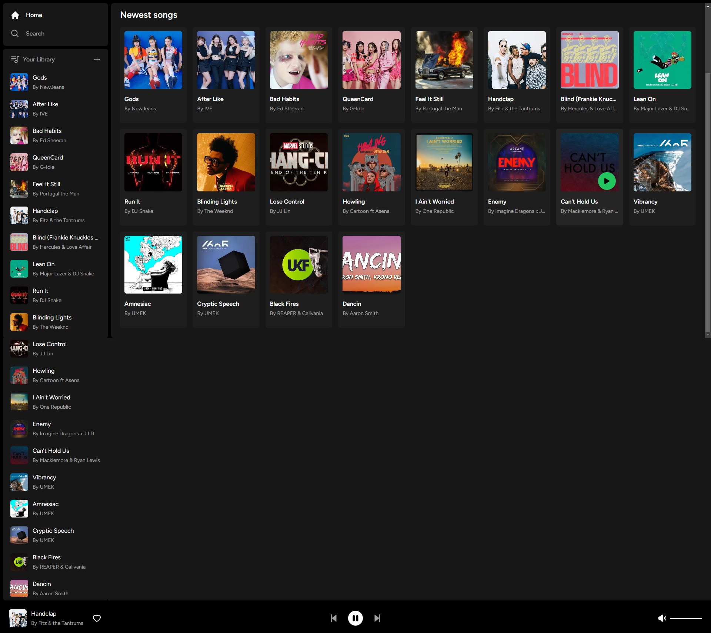
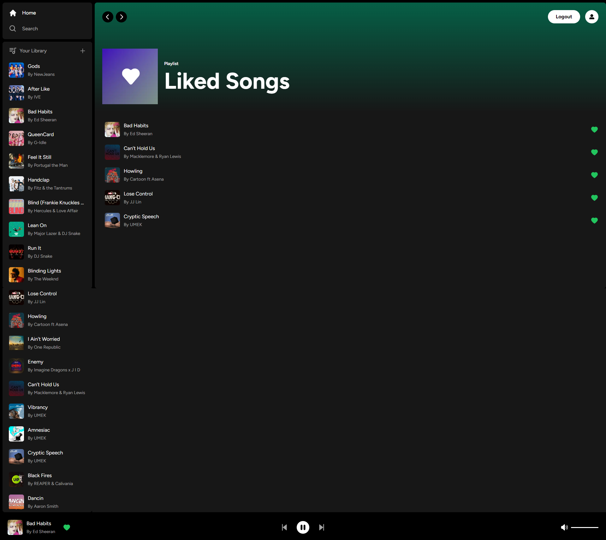

# Musicify

  ##  Table of Contents 
   - [Description](#desc) 
   - [Installation](#ins)
   - [Usage](#use)
   - [Contribution Guidlines](#con) 
   - [Test Instructions](#test)
   - [Frameworks and resources](#frame)
   - [Questions/Contact](#ques)
   - [License](#license) 
  
  # Description 
  Musicify is a spotify-esque application built with Next.Js, React.js, Tailwind CSS, Stripe integration for payments and Supabase/PostgreSQL as the database. 
  
  # Installation 
  No installation required; visit the website, create an account and subscribe to the musicify premium plan to begin adding songs or listening to the music available. 
   
   
  NOTE: please use a real email to signup as a link will be sent to that email which requires verification. When subscribing to musicify's %9 premium plan PLEASE use the card number 4242 4242 4242 4242 and fill out the remaining fields with fake info as that will allow you to bypass putting in a legitimate card number. 
  
  # Usage 

  [Application Link](https://musicify-175f0766b215.herokuapp.com/)

  Users may add their own songs to the library granted they have the mp3 file and an image to set as cover art. Otherwise you may like/play songs added by other users

  # Images
  

  # Contribution Guidelines 
  None
  
  # Test Instructions 
  N/A

  # Frameworks/Resources Used 
  - React.js
  - NEXT.js
  - Supabase
  - PostgreSQL
  - Stripe
  - Tailwind CSS

  
  # Questions/Contact 
  <a href="https://github.com/Dannymak1993">Danny Mak</a>
   
  
  # License
   https://opensource.org/licenses/MIT 
  
  
